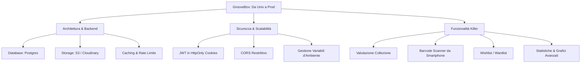

# Analisi Completa di GrooveBox

Questo documento fornisce un'analisi approfondita del progetto **GrooveBox**, delineando i cambiamenti necessari per trasformare questa applicazione universitaria in un prodotto commerciale, sicuro, scalabile, interessante e pronto per la pubblicazione.

---

## 1. Stato Attuale del Progetto

GrooveBox è un'applicazione web per la gestione di collezioni di supporti musicali fisici (Vinili, CD, Cassette).
L'architettura attuale è così composta:

*   **Backend (Python/Flask)**: Utilizza SQLite come database relazionale, con query SQL scritte a mano gestite tramite un Data Access Layer (DAL). L'autenticazione è implementata tramite token JWT personalizzati inviati negli header Authorization.
*   **Frontend (Vue 3/Pinia/Vite)**: Sviluppato in Vue 3 con Pinia per la gestione dello stato globale e Tailwind CSS v4 per lo styling. Il layout ha un'estetica ispirata allo stile premium di Apple (glassmorphism, animazioni curate, layout responsivo).
*   **Integrazione Discogs**: È stata recentemente aggiunta la possibilità di cercare e importare album e artisti tramite le API ufficiali di Discogs, memorizzando i dati nel database locale per poi collegarli alle copie fisiche degli utenti.

---

## 2. Impatto del Passaggio a Discogs sulla UI/UX

La decisione di eliminare il crowdsourcing in favore di Discogs ha un impatto profondo sul flusso di utilizzo (User Flow) dell'applicazione. Di seguito sono elencate le modifiche consigliate a livello di interfaccia utente:

### 2.1 Ricerca Unificata (Local + Discogs)
*   **Problema**: Attualmente, la barra di ricerca principale del catalogo (`AlbumCatalog.vue`) filtra solo gli album già importati localmente. Per aggiungere un album non ancora presente, l'utente deve cliccare su "Aggiungi disco", selezionare la tab "Discogs", effettuare una nuova ricerca e cliccare su "Importa".
*   **Soluzione**: Creare una barra di ricerca unificata. Quando l'utente cerca un disco:
    1. Mostrare i risultati trovati nel database locale (veloci e già pronti).
    2. Sotto, o in una sezione dedicata "Dall'archivio globale", mostrare i risultati di Discogs in tempo reale.
    3. Cliccando su un risultato di Discogs, l'utente può visualizzarne i dettagli o aggiungerlo alla collezione; il sistema importerà l'album in background (Zero-Click Import).

### 2.2 Importazione Trasparente e "Zero-Click"
*   **Problema**: Il concetto di "Importa nel catalogo globale" è un concetto tecnico che non dovrebbe essere esposto all'utente finale.
*   **Soluzione**:
    *   Rendere l'importazione automatica in background.
    *   In `CollectionView.vue`, quando l'utente desidera aggiungere una copia fisica, la modale di inserimento dovrebbe permettergli di cercare direttamente su Discogs. Alla selezione del disco, l'importazione dell'album e dell'artista nel database locale avviene in background, e all'utente viene mostrato direttamente il modulo per impostare le condizioni della copia fisica (Formato, Condizione, Note personali).

### 2.3 Rimozione/Declassamento del Form Manuale
*   **Problema**: Avendo sposato il modello Discogs, mantenere un form di creazione manuale prominente rischia di sporcare il database locale con record duplicati o formattati male.
*   **Soluzione**: Rimuovere il form manuale o declassarlo a fallback secondario nascosto sotto un pulsante *"Non trovi il disco su Discogs? Aggiungilo manualmente"* (utile per stampe ultra-rare o autoproduzioni locali).

### 2.4 Valorizzazione delle Informazioni Rich
*   L'integrazione con Discogs importa dati ricchi come la **Tracklist** dell'album e la **Biografia / Foto** dell'artista.
*   La UI delle pagine di dettaglio (`AlbumDetail.vue` e `ArtistDetail.vue`) deve essere arricchita:
    *   **AlbumDetail**: Mostrare la tracklist formattata come una tabella pulita con posizioni e durate dei brani, e un badge cliccabile che rimanda alla pagina ufficiale di Discogs.
    *   **ArtistDetail**: Presentare la biografia dell'artista (gestendo le formattazioni di testo) e mostrare la foto profilo con un layout moderno.

---

## 3. Cosa Cambiare nel Progetto in Generale (Pronti per la Pubblicazione)

Per pubblicare l'applicazione e renderla interessante sul mercato, è necessario superare i limites di un progetto didattico affrontando aspetti strutturali, di sicurezza e di business logic.

### 3.1 Miglioramenti Architetturali e Infrastruttura
1.  **Migrazione del Database (da SQLite a PostgreSQL)**:
    *   *Perché*: SQLite non è progettato per gestire molti utenti simultanei in ambienti cloud di produzione (concorrenza in scrittura, scalabilità).
    *   *Cosa fare*: Configurare una connessione a PostgreSQL (es. tramite servizi gestiti come Supabase o Neon) e adattare le query SQL del DAL (o introdurre un ORM leggero come SQLAlchemy per facilitare la gestione).
2.  **Storage Cloud per i Media (AWS S3 / Supabase Storage / Cloudinary)**:
    *   *Perché*: Attualmente le immagini caricate (copertine, foto artisti) vengono salvate sul file system locale del server. Nelle moderne piattaforme cloud (es. Heroku, Render, AWS ECS), il file system è effimero e viene cancellato a ogni riavvio o rilascio del codice.
    *   *Cosa fare*: Salvare i file su un Object Storage esterno e salvare nel DB l'URL assoluto della risorsa.
3.  **Caching e Limitazione della Rate-Limit di Discogs**:
    *   *Perché*: Le API di Discogs sono limitate a **60 richieste al minuto** per token/IP. Se più utenti utilizzano l'app contemporaneamente, il limite verrà superato immediatamente, bloccando l'app.
    *   *Cosa fare*: Implementare un sistema di caching delle query di ricerca e dei dettagli delle release (es. tramite Redis o una tabella di cache locale) in modo da non interrogare Discogs per dati già cercati o importati di recente.

### 3.2 Sicurezza e Robustezza
1.  **Gestione dei Token JWT (Protezione XSS)**:
    *   *Perché*: Attualmente, il frontend salva il token JWT nel `localStorage` del browser. Questo espone l'applicazione a vulnerabilità Cross-Site Scripting (XSS): se un malintenzionato riesce a iniettare uno script JS, può rubare il token dell'utente.
    *   *Cosa fare*: Spostare il salvataggio dei JWT in un **HttpOnly Cookie** configurato con attributi `Secure` e `SameSite=Strict`. Questo impedisce al codice JavaScript del frontend di accedere direttamente al token, azzerando il rischio di furto via JS.
2.  **CORS (Cross-Origin Resource Sharing)**:
    *   *Perché*: In `app.py`, CORS è configurato con `{"origins": "*"}` (accetta chiamate da qualunque sito). In produzione, questo è un rischio di sicurezza.
    *   *Cosa fare*: Configurare le origini consentite in base all'ambiente di deployment, abilitando solo il dominio reale del frontend.
3.  **Pianificazione dei Ruoli Utente**:
    *   Nel router del frontend, l'accesso alla lista artisti (`/artists`) è riservato ad `administrator`. Se un collector vuole cercare un artista, può farlo? Attualmente sì, ma non ha una pagina catalogo artisti. Sarebbe utile aprire la consultazione del catalogo artisti a tutti, limitando agli admin solo le azioni di scrittura/eliminazione.

---

## 4. Idee per rendere l'App "Interessante" ed Emergente (Killer Features)

Un semplice catalogo personale non basta per attirare utenti. Per rendere GrooveBox unica sul mercato, proponiamo di implementare le seguenti funzionalità:

### 4.1 Valutazione Economica della Collezione (Marketplace Tracker)
*   **Idea**: Discogs fornisce per ogni release una stima di valore (prezzo minimo, medio e massimo a cui è stato venduto sul loro marketplace).
*   **Implementazione**: Recuperare queste informazioni durante l'importazione dell'album e mostrare nella Dashboard dell'utente una stima del valore economico complessivo della sua collezione (es: *"Il valore stimato della tua collezione è tra 450€ e 1.200€ (Valore Medio: 780€)"*). Questa è una delle funzionalità più amate dai collezionisti di vinili.

### 4.2 Barcode Scanner Integrato (Mobile-First)
*   **Idea**: Consentire agli utenti di usare la fotocamera dello smartphone per scansionare il codice a barre stampato sulla copertina del vinile o del CD.
*   **Implementazione**: Integrare una libreria JavaScript leggera nel frontend (come `html5-qrcode` o `quagga2`). Lo scanner decodifica il barcode, interroga l'API di Discogs (`/database/search?barcode=...`) e aggiunge istantaneamente il disco corretto alla collezione dell'utente.

### 4.3 Wishlist (Lista dei Desideri)
*   **Idea**: Oltre alla collezione di dischi posseduti, i collezionisti amano tenere traccia dei dischi che vorrebbero acquistare.
*   **Implementazione**: Creare una sezione "Wishlist" separata. L'utente può cercare su Discogs e cliccare su "Aggiungi alla Wishlist". Se in futuro acquista il disco, può spostarlo nella "Collezione" fisica compilando i dettagli della copia fisica.

### 4.4 Sincronizzazione / Importazione da Account Discogs
*   **Idea**: Chi ha collezioni molto grandi (es. 200+ dischi) non userà mai una nuova app se deve re-inserire tutto da capo.
*   **Implementazione**: Consentire all'utente di inserire il proprio username di Discogs e importare in blocco (tramite un task asincrono in background) tutta la collezione o la wantlist già salvata su Discogs.

### 4.5 Statistiche Visive (Data Visualization)
*   Sostituire la prima pagina di statistiche testuali con grafici interattivi (utilizzando librerie come `Chart.js` o `ApexCharts` integrate in Vue):
    *   Grafico a torta sulla distribuzione dei generi della collezione.
    *   Grafico a barre dei formati posseduti (es. 70% Vinili, 20% CD, 10% Cassette).
    *   Timeline degli acquisti (quanti dischi acquistati per mese/anno).
    *   Distribuzione cronologica delle release (es. quanti dischi degli anni '70, '80, '90, ecc.).
